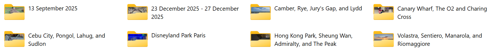

#  GroupMachine

<p>    
  </p>

_A cross-platform command-line tool (Windows, Linux, macOS) for grouping photos and videos into albums (folders) based on time and location changes.
It can also name these albums using real-world place names, making them easier to browse._

## 📚 Overview

GroupMachine helps you organize large collections of photos and videos by grouping them into albums based on when and where they were taken.
It’s especially useful if you’ve downloaded images from your camera, mobile phone or cloud service (like Apple iCloud or Google Photos),
which often contain large, mixed sets from multiple locations and dates.

By default, the tool groups your photos and videos into albums - which are simply folders containing related media files. It creates a new album
whenever there’s a significant gap in time or location between your shots (for example, different cities or days apart). This way, the folder structure
naturally reflects your trips, events, or outings without manual sorting.

If you supply a GeoNames database file (freely downloadable) then GroupMachine can rename the folders to actual place names.

>[!TIP]
>Once you've grouped your photos, [SideBySide](https://github.com/mrsilver76/sidebyside) can combine two portrait shots into a single landscape image, making them ready for digital frames without awkward cropping or black bars.

## 🧰 Features

- 💻 Runs on Windows, Linux and macOS across x86, x64 and ARM devices.
- 📂 Organises photos and videos into albums (folders) based on time and location.
- 🗺️ Names albums using real-world place names with the GeoNames database.
- 📍 Infers missing GPS locations from nearby media taken at a similar time.
- 🍏 Keeps Apple Live Photos together as a single item.
- 🧭 Supports configurable time, distance and location precision thresholds.
- 📅 Customises album names with flexible date formats, prefixes and suffixes.
- 📦 Copies, moves, links or simulates changes without modifying your originals.
- 🧠 Detects identical files to avoid unnecessary duplicates.
- ⏳ Supports incremental processing using date filters and resume support.

## 🧩 How does GroupMachine work?

GroupMachine is designed around the way people typically take photos and videos. That is by taking short bursts of content in one place (on holiday, a day out or an event) before moving on to somewhere else. GroupMachine uses this pattern to work out which content belongs together and organise it into albums.

1. GroupMachine scans one or more folders and creates a list of all the photos and videos it finds.
2. It examines each file to determine when and where it was taken. This information is normally taken from the metadata stored in the file. If the date, time or location is missing, GroupMachine can infer it from other nearby photos and videos where possible.
3. The content is then ordered by the date and time it was taken.
4. GroupMachine works through the content in chronological order, grouping together photos and videos that were taken close together in time and location. By default, content can be grouped when it is within 48 hours and 10 km of the surrounding content. When these boundaries are exceeded, a new group is started.
5. Each group becomes an album. GroupMachine creates a folder for each album and names it using the date range of the content. If a GeoNames database is provided, it can instead use the name of the place where the content was taken.
6. Finally, GroupMachine moves, copies or links each photo and video into the folder for its album, depending on the selected options.

The result is a set of albums (one per folder) that reflect how the content was actually captured, rather than simply splitting it by date.

|  |
|-|

For more detail on how albums are created and named, see:

* [How grouping works](GROUPING.md)
* [How album names are created](ALBUM-NAMES.md)

## 📦 Download

Get the latest version from the [Releases page](https://github.com/mrsilver76/groupmachine/releases).

Each release includes the following files (`x.x.x` denotes the version number):

|Platform|Download|
|:--------|:-----------|
|Microsoft Windows 10 & 11|`GroupMachine-x.x.x-win-x64.exe` ✅ **Most users should choose this**|
|Linux (x64 Intel/AMD)|`GroupMachine-x.x.x-linux-x64`|
|Linux (ARM64), e.g. Pi 4 and newer|`GroupMachine-x.x.x-linux-arm64`|
|Linux (ARM32), e.g. Pi 3 and older|`GroupMachine-x.x.x-linux-arm`|
|Docker, e.g. Synology NAS|`GroupMachine-x.x.x-linux-x64`|
|macOS (Apple Silicon ARM64)|`GroupMachine-x.x.x-osx-arm64`|
|macOS (Intel x64)|`GroupMachine-x.x.x-osx-x64`|
|Developers or other platforms|Source code (zip / tar.gz)|

## 🛠️ Installation

GroupMachine does not use an installer on Windows, macOS or Linux. Download the appropriate file from the table above and run it from the command line.

GroupMachine requires the [.NET 8 Runtime](https://dotnet.microsoft.com/en-us/download/dotnet/8.0/runtime). Do not install the SDK, ASP.NET Core Runtime, or Desktop Runtime.

### Windows users

- Download `GroupMachine-x.x.x-win-x64.exe`.
- No installation is required. Save the executable anywhere you like.
- Open Command Prompt or Windows Terminal and run it from that folder.
- If Windows SmartScreen warns that the app is unrecognised, click **More info** then **Run anyway**.

### macOS users

- Download the appropriate binary for your platform (see table above).
- Make the downloaded file executable: `chmod +x GroupMachine-x.x.x-<your-platform>`
- If you get `zsh: killed` when running the executable then:
  - Apply an ad-hoc code signature: `codesign --force --deep --sign - GroupMachine-x.x.x-<your-platform>`
  - Remove the quarantine attribute: `xattr -d com.apple.quarantine GroupMachine-x.x.x-<your-platform>`

### Linux users

- Download the appropriate binary for your platform (see table above).
- Make the downloaded file executable: `chmod +x GroupMachine-x.x.x-<your-platform>`

### Docker users

- Use the `GroupMachine-x.x.x-linux-x64` binary inside the container.
- Install the [.NET 8.0 Linux runtime](https://learn.microsoft.com/en-gb/dotnet/core/install/linux) inside the container or use a [.NET container image](https://learn.microsoft.com/en-gb/dotnet/core/docker/introduction#net-images).
- Mount your photo folders into the container with appropriate read and write access.

### Platform support and testing

* Tested extensively: Windows 11  
* Tested moderately: Linux ARM64 (Raspberry Pi 5)  
* Not tested: Windows 10, Linux x64, Linux ARM32, Docker, macOS (Intel & Apple Silicon)

>[!NOTE]
>I do not have hands-on experience with Docker or macOS environments. GroupMachine should work, but platform-specific support will be limited.

## 🚀 Quick start guide

### Basic album organisation with dated folders

This example organises a collection of photos and videos into dated albums. It scans `d:\Photos` and all subfolders, groups files taken within 48 hours and 10 km of each other into the same album, then moves them into dated folders under `e:\My Album`. Album names use the default date format (for example, `20 Jul 2025` or `20 Jul 2025 - 22 Jul 2025`).

> [!TIP]
> If this is your first time using GroupMachine, use `-s` (instead of `-c`, `-m` or `-l`) to run in simulate mode. This shows what would happen without actually copying, moving or linking any files.
```
GroupMachine "d:\Photos" -m -r -o "e:\My Album"
```
Explanation of options:

- `"d:\Photos"`: Source folder containing your photos and videos
- `-m`: Move files into the new album structure
- `-r`: Search subfolders recursively
 - `-o "e:\My Album"`: Destination folder for the albums

### Name albums by location using GeoNames

This example uses the GeoNames `allCountries.txt` database, the complete worldwide database of places and points of interest, to name albums based on location. GroupMachine uses specific landmarks where available and falls back to broader place names when needed. The four digit year is appended to each album name, and files are copied rather than moved, leaving the originals untouched.

```
GroupMachine "d:\Photos" -o "e:\My Album" -r -g c:\temp\allCountries.txt -a "YYYY" -c
```
Explanation of options:

- `"d:\Photos"`: Source folder containing your photos and videos
- `-o "e:\My Album"`: Destination folder for the albums
- `-r`: Search subfolders recursively
- `-g c:\temp\allCountries.txt`: Use the GeoNames database for location based album names
- `-a "YYYY"`: Append the four digit year to each album name
- `-c`: Copy files into the new album structure, leaving the originals unchanged

### Customising album grouping and output format

This example shows how to customise the way GroupMachine creates albums. It changes the grouping thresholds to 24 hours and 50 km, uses ISO-8601 date formatting (`yyyy-MM-dd`) for folder names, skips video files, and creates links to files instead of copying them.

Links avoid duplicating storage space by allowing multiple album folders to reference the same original files. When `-l` (`--link`) is used, GroupMachine will create hard links where possible, and automatically fall back to soft links when hard links cannot be created.

```
GroupMachine "d:\Photos" -r -o "d:\My Album" -t 24 -d 50 -f "yyyy-MM-dd" -nv -l
```
Explanation of options:

- `"d:\Photos"`: Source folder containing your photos and videos
- `-r`: Search subfolders recursively
- `-o "d:\My Album"`: Destination folder for the albums
- `-t 24`: Group photos taken within 24 hours of each other
- `-d 50`: Group photos taken within 50 km of each other
- `-f "yyyy-MM-dd"`: Use ISO-8601 date formatting for album names
- `-nv`: Skip video files
- `-l`: Create hard links where possible, falling back to soft links when required

## 💻 Command line options

GroupMachine is a command-line tool. Run it from a terminal or command prompt, supplying all options and arguments directly on the command line. Logs with detailed information are also written and you can find the log file location using `--help` (`-h`).

```
GroupMachine [options] -o <folder> <mode> <source> [<source> ...]
```

### Mandatory

- **`-o <folder>`, `--output <folder>`**   
  Specifies the destination folder for grouped albums. If the folder does not exist, it will be created automatically.

- **`<source folder> [<source folder> ...]`**   
  One or more folders containing the photos and videos to be grouped.

### Mode (exactly one mandatory)
  
- **`-c`, `--copy`**  
  Copy files from the source folder to the destination folder.

- **`-m`, `--move`**  
  Move files from the source folder to the destination folder.

- **`-l`, `--link`**  
  Link files from the source folder to the destination folder. This avoids duplicating content by creating a reference to the original file instead of copying it. GroupMachine first attempts to create a [hard link](https://en.wikipedia.org/wiki/Hard_link), which behaves like a real file and doesn’t depend on the original path. If that fails (e.g. across different drives), it falls back to creating a [soft link](https://en.wikipedia.org/wiki/Symbolic_link) (symbolic link), which points to the original file and breaks if that file is moved or deleted.

- **`-s`, `--simulate`**  
  Runs all processing steps and outputs a report explaining what would happen. No files are copied, moved or linked. This is ideal for testing and previewing changes.

>[!NOTE]
>Files are _never_ overwritten. If a file with the same name already exists in the destination, it is compared by content. If the files are not binary identical, a number is appended to the new file (e.g., `IMG_1234 (2).jpg`) to preserve both versions.

### File selection

- **`-r`, `--recursive`**  
  Recursively scan all subfolders within the specified source folders.

- **`-nv`, `--no-video`**  
  Exclude videos (`.mp4`, `.mov` and `.m4v`) from scanning.
  
- **`-np`, `--no-photo`**  
  Exclude photos (`.jpg` and `.jpeg`) from scanning.

- **`-df <date>`, `--date-from <date>`**  
  Include only files taken after this date. Files *earlier* than this date will be ignored. You must supply the date (and optional time) in ISO 8601 format: `yyyy-mm-dd` or `yyyy-mm-dd hh:mm:ss`. If you don't provide a time then midnight will be assumed.

 >[!TIP]
 >You can also use the special value `last` to continue processing from the last file processed in a previous run. This is useful
 >when you are incrementally grouping new photos without reprocessing everything.

- **`-dt <date>`, `--date-to <date>`**  
  Include only files taken on or before this date. Files *later* than this date will be ignored. You must supply the date (and optional time) in ISO 8601 format: `yyyy-mm-dd` or `yyyy-mm-dd hh:mm:ss`. If you don't provide a time then midnight will be assumed.

 >[!TIP]
 >You can also use the special value `last` to continue up to the last processed file from a previous run. This is useful when limiting processing to a specific time window or when resuming partial groupings.

- **`-xr` (`--exclude-recent`)**  
  Exclude very recent files within the `-t` (`--time`) time threshold (default is 48 hours) when 
  grouping into albums. This holds off processing new content until it’s clear that 
  no additional photos or videos will be added to the same album.

  For example, imagine you take a series of photos in the evening. If you run 
  GroupMachine immediately, it might create an album with just the first few photos. 
  A couple of days later, running GroupMachine again would group the remaining photos 
  from that evening into a new album, even though they logically belong with the 
  album created on the previous run - since they were taken within the same `-t` (`--time`) timeframe. Using `-xr` (`--exclude-recent`) delays processing of the 
  first set of files, ensuring that all photos are correctly grouped together in a 
  single album once no further related content is expected.
  
>[!NOTE]
>If you specify an end date and time with `-dt` (`--date-to`) that goes beyond the 
>window required by `-xr` (`--exclude-recent`), the date and time will be adjusted forward to ensure 
>that very recent files within the `-t` (`--time`) threshold are still ignored.

### Grouping logic

- **`-d <number>`, `--distance <number>`**   
  Distance threshold in kilometers. If two consecutive photos or videos are taken more than this distance apart, a new album is started. Set to `0` to disable distance-based grouping. If not supplied, the default is 10 km.

  In regions where towns and landmarks are more widely spaced, a larger distance than the default 10 km may produce better album names - for example, the United States, Canada, Australia and New Zealand.

- **`-t <number>`, `--time <number>`**   
  Time threshold in hours. If two consecutive photos or videos are taken more than this many hours apart, a new album is started. Set to `0` to disable time-based grouping. If not supplied, the default is 48 hours.

### Album naming

- **`-g <file>`, `--geocode <file>`**   
  Full path to a [GeoNames database file](https://download.geonames.org/export/dump/) in `.txt` format. Providing this file enables automatic renaming of albums based on location data. You will need to manually decompress the `.zip` file provided by the GeoNames website before you can use it with GroupMachine.

>[!TIP]
>For best performance, store the [GeoNames database file](https://www.geonames.org/export/) on a local SSD. Loading it from a network share, USB drive, or HDD can be much slower.

- **`-f <format>`, `--format <format>`**   
  Date format used for album folder names that use dates. This follows the [.NET DateTime format syntax](#datetime-format-syntax). The default is `dd MMM yyyy` (e.g., _"20 Jul 2025"_). Used when no GeoNames data is provided or no location can be determined.

- **`-p <number>`, `--precision <number>`**   
  Defines how detailed the location names are when GroupMachine generates album titles. Lower levels produce broader, more general location names, while higher levels allow more specific locations to be considered.

  The default is level 3 (precise).

  | Level | Precision | Location tiers considered                                        | Example                                                     |
  |:----- |:--------- |:---------------------------------------------------------------- |:----------------------------------------------------------- |
  | 1     | Broad     | Larger geographic features and final fallback locations          | _Somerset, Provence-Alpes-Côte d’Azur, English Channel_       |
  | 2     | Standard  | Local features, populated places, and broader fallback locations | _Le Marais, Montmartre, Latin Quarter_                        |
  | 3     | Precise   | All location tiers, including spot features  **✅ Default**      | _Eiffel Tower, Louvre Museum, Notre-Dame Cathedral_ |

  Higher precision levels allow GroupMachine to use more specific locations when they are available. For example, level 3 first checks for nearby spot features before falling back to local areas, towns, cities, and larger geographic features. If a more specific location cannot be found, GroupMachine continues searching using the broader location tiers available for that precision level.
  
  Spot features are individual landmarks, buildings, or points of interest. Level 3 includes selected spot features that are typically relevant for tourist photography:

  - **Cultural landmarks:** castles, monuments, palaces, temples, mosques, churches, theatres, opera houses.
  - **Historic and archaeological sites:** ruins, tombs, pyramids, historical or archaeological sites.
  - **Recognisable structures:** towers, arches, caves, lighthouses, piers, quays, squares, gardens.
  - **Public institutions and attractions:** museums, zoos, famous universities, public libraries, stadiums.
  - **Leisure and resort areas:** marinas, resorts, golf courses, spas.
  - **Religious or spiritual locations:** missions, shrines.

  The list of spot features is fixed and cannot be changed.
  
- **`-a <format>`, `--append <format>`**  
  Date format to append to album folder names that use locations. Useful to distinguish multiple visits to the same location. Dates are appended within brackets - e.g. using `MMM yyyy` will produce "_Paris, Boulogne-Billancourt, and Saint-Denis (Apr 2025)_". Dates are defined using the [.NET DateTime format syntax](#datetime-format-syntax).

 - **`-nr`, `--no-range`**  
  Don't use a date range in album titles. By default, GroupMachine adds a date range (e.g. _"12 Jun 2025 – 14 Jun 2025"_, using the format defined by `-f`, `--format`) when an album spans multiple days. With this option enabled, album names always use the date of the first item in the group, even if later items fall on different days.

- **`-np`, `--no-part`**  
  Don't add part numbers to album titles. Normally, if multiple albums form on the same day, date range or in the same location (e.g. due to the distance threshold being exceeded), GroupMachine appends part numbers to distinguish them (e.g. _"Paris (part 2)"_). With this option enabled, part numbers are omitted and such groups are merged into a single album.

>[!TIP]
>If you regularly visit the same locations at different times of the year and want to keep those visits separate, consider appending the date, month, or year to album names using the `-a` (`--append`) option.

- **`-pa <text>`, `--prefix-album <text>`**  
  Adds custom text in front of each album folder name. If the text contains `/` (or `\` on Windows), it is treated as part of the folder path, allowing you to create sub-folders. You can also include `<...>` placeholders using the [.NET DateTime format syntax](#datetime-format-syntax), which will expand based on the album’s date range.
 
#### Examples

Below are a few examples of using the prefix option to modify album names and/or create subfolders. In all cases, the album date is 5 April 2025. Examples marked with ⚠️ may produce unintended results, so pay special attention to them.

|Command|Without GeoNames|With GeoNames|Notes|
|:------|:---------------|:------------|:----|
|`-pa "Trip to "`|`Trip to 5 Apr 2025 - 6 Apr 2025`|`Trip to Paris, Boulogne-Billancourt, and Saint-Denis`|Prefix every album.|
|`-pa "Weekend in"`|`Weekend in5 Apr 2025 - 6 Apr 2025`|`Weekend inParis, Boulogne-Billancourt, and Saint-Denis`|⚠️ **Missing trailing space causes run-on names!**|
|`-pa "<yyyy>/"`|`2025/5 Apr 2025 - 6 Apr 2025`|`2025/Paris, Boulogne-Billancourt, and Saint-Denis`|Creates a year subfolder.|
|`-pa "<yyyy>/<MM>_"`|`2025/04_5 Apr 2025 - 6 Apr 2025`|`2025/04_Paris, Boulogne-Billancourt, and Saint-Denis`|As above, but also month prefix on album name.|
|`-pa "Year <yyyy>/<MMMM>/"`|`Year 2025/April/5 Apr 2025 - 6 Apr 2025`|`Year 2025/April/Paris, Boulogne-Billancourt, and Saint-Denis`|Deeper nesting folders.|
|`-pa "<yyyy>\<MMM>- "`|`2025\Apr- 5 Apr 2025 - 6 Apr 2025`|`2025\Apr- Paris, Boulogne-Billancourt, and Saint-Denis`|Windows path seperator also supported.|
|`-pa "<yyyy>"`|`20255 Apr 2025 - 6 Apr 2025`|`2025Paris, Boulogne-Billancourt, and Saint-Denis`|⚠️ **No trailing `/` or `/` means prefix not folder.**|

>[!CAUTION]
> - If you don’t include a trailing space in your prefix, the album name will run directly after your text.  
> - If you are creating sub-folders, the prefix must end with `/` (or `\` on Windows) otherwise the text will be added to the folder name instead of making a new folder.

- **`-u`, `--unique`**  
  Always create new, unique albums. By default (and when using locations), GroupMachine may place photos into an existing folder if the album name matches. This can cause conflicts if you have two albums with the same name taken at different times. Using `-u` (`--unique`) forces a new folder to be created on each run. New folders use the same name with a numeric suffix such as `(1)`, `(2)`, and so on.

  You can also use `-pa` (`--prefix-album`) and/or `-a` (`--append`) to change the album name by adding extra text. Both options can make an album title unique without relying on numeric suffixes.

### Others

- **`-nc`, `--no-check`**  
  Disables GitHub version checks for GroupMachine.

  Version checks occur at most once every 7 days. GroupMachine connects only to [this URL](https://api.github.com/repos/mrsilver76/groupmachine/releases/latest) to retrieve version information. No data about you or your photo/video library is shared with the author or GitHub - you can verify this yourself by reviewing `GitHubVersionChecker.cs`

- **`-ha <type>`, `--hash-algo <type>`**  
  Select the hashing algorithm for duplicate detection. By default, GroupMachine uses CRC64-ECMA-FAST, a very fast 64-bit checksum that reads only the first 64 KiB of each file. This is extremely efficient for spotting duplicates in large collections. You can override this with:

  -  `md5` - Well-known and widely supported. Reads the entire file, so it is slower than CRC64-ECMA-FAST, but more accurate for full-file deduplication.
  -  `sha` - Strong cryptographic hash. Slowest option, but provides maximum certainty when comparing full files. GroupMachine automatically chooses SHA256 on 32-bit systems and SHA512 on 64-bit systems.

- **`-mp <number>`**, **`--max-parallel <number>`**  
   Controls how many files are processed at the same time during copying, moving, or linking. By default, GroupMachine automatically chooses a safe number of parallel tasks based on your CPU and storage type. If you experience crashes, performance or stability issues, try reducing the number of parallel tasks. Use `-h` (`--help`) to see the default value for your system.

- **`/?`. `-h`, `--help`**  
  Displays the full help text with all available options, credits and the location of the log files.

### DateTime format syntax

The `-f` (`--format`), `-a` (`--append`) and `-pa` (`--prefix-album`) options accept date formats using the .NET DateTime format syntax, allowing you to customize how dates appear. Below is a list of commonly used date formats for your reference:

|Format String|Description|Example Output|
|:------------|:----------|:-------------|
|`dd MMM yyyy`|Day (two digits) Month abbrev. Year (four digits)|`20 Jul 2025`|
|`dd MMMM yyyy`|Day (two digits) Full month name Year (four digits)|`20 July 2025`|
|`MM/dd/yyyy`|Month/day/year (common US format)|`07/20/2025`|
|`dd/MM/yyyy`|Day/month/year (common UK format)|`20/07/2025`|
|`yyyy-MM-dd`|ISO 8601 format (sortable)|`2025-07-20`|
|`MMMM yyyy`|Full month name and year|`July 2025`|
|`MMM yyyy`|Abbreviated month name and year|`Jul 2025`|
|`yyyy`|Year only|`2025`|
|`dd-MM-yyyy`|Day-month-year with dashes|`20-07-2025`|

For a complete list of format specifiers, see Microsoft's [Custom date and time format strings](https://learn.microsoft.com/en-us/dotnet/standard/base-types/custom-date-and-time-format-strings#:~:text=The%20following%20table%20describes%20the%20custom%20date%20and%20time%20format%20specifiers%20and%20displays%20a%20result%20string%20produced%20by%20each%20format%20specifier.) documentation.

## 🔄 Automating downloads and album creation

You can run GroupMachine manually on any folder of photos/videos whenever you like. This is quick, flexible, and works well if you prefer to organise albums on demand.

However, for those who want more automation, you can also create a workflow that automatically downloads new photos from your cloud service (for example, iCloud or Google Photos) and then groups them into albums using GroupMachine. This allows you to maintain an organized library without manually moving files each time.

For more information about this approach, see [AUTOMATION.md](AUTOMATION.md)

## 🛟 Questions/problems?

Please raise an issue at https://github.com/mrsilver76/groupmachine/issues.

## 💡 Future development: open but unplanned

GroupMachine currently meets the needs it was designed for, and no major new features are planned at this time. However, the project remains open to community suggestions and improvements. If you have ideas or see ways to enhance the tool, please feel free to submit a [feature request](https://github.com/mrsilver76/groupmachine/issues).

## 📝 Attribution

- Gallery icons by Freepik - Flaticon (https://www.flaticon.com/free-icons/gallery)
- Apple and iCloud are trademarks of Apple Inc., registered in the U.S. and other countries. This tool is not affiliated with or endorsed by Apple Inc.
- Google and Google Photos are trademarks of Google LLC. This tool is not affiliated with or endorsed by Google LLC.
- .NET is a trademark of Microsoft Corporation. This tool is developed using the .NET platform but is not affiliated with or endorsed by Microsoft.
- GeoNames is a project of Unxos GmbH. This tool is not affiliated with or endorsed by Unxos GmbH.

## 🕰️ Version history

See [CHANGELOG.md](CHANGELOG.md)
